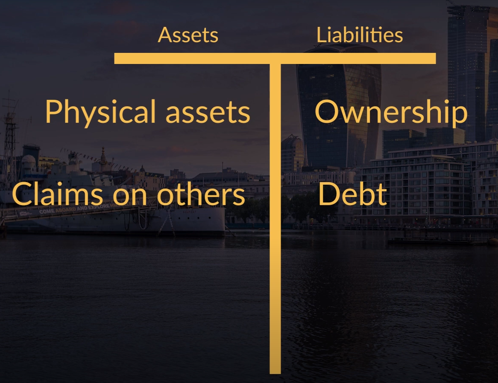
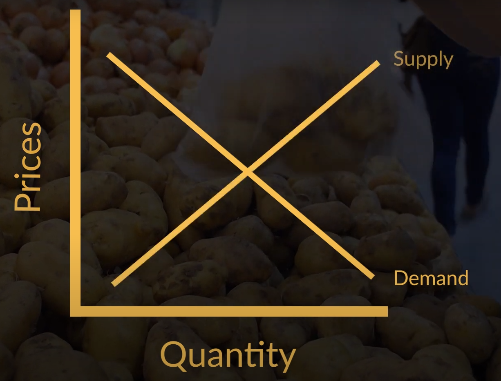

Whenever people talk about Money Printing they often exclusively focus on cases where money printing went horribly wrong. For example, they might talk about how money printing in the 1920s in [Germany](https://www.bbc.co.uk/bitesize/guides/z9y64j6/revision/5) led to hyperinflation and how that set the scene for the [rise of the Nazi party](https://www.bbc.co.uk/bitesize/guides/zsrwjxs/revision/6). Or about the massive hyperinflation in [Zimbabwe](https://www.fin24.com/Economy/Africa/its-official-hyperinflation-has-returned-to-zimbabwe-20191012) in 2007, which destroyed an economy that was once known as the [jewel](https://www.voazimbabwe.com/a/zimbabwe-economy-battered-over-the-years/2724325.html) of Southern Africa.

This post explores if it is possible to do money printing responsibly. In other words, when is money printing a viable economic strategy and when will it bring economic ruin?

*If you prefer to consume this story in video format, check it out here:*

<iframe width="560" height="315" src="https://www.youtube.com/embed/eKEjDs8UB80" frameborder="0" allow="accelerometer; autoplay; encrypted-media; gyroscope; picture-in-picture" allowfullscreen></iframe>

Before discussing situations in which money printing can be done responsibly, let’s first establish what money printing is.

What happens when the central bank actually prints money?

Instinctively, money printing can be thought of as the physical act of printing bank notes.
But to truly understand money printing, it is important to look beyond the physical act of printing.

In my opinion, money printing can best be understood by viewing it through simple balance sheets like these:

The balance sheet of an entity consists of both assets and liabilities. Assets are typically depicted on the left side of the balance sheet and contain both physical assets, such as buildings, or machines that the entity owns, as well as claims that the entity has on others, think about debt claims if the entity is a bank, or company shares if the entity is an investor.

On the liability side of the balance sheet, all claims on the entity are depicted. These can thus be seen as claims on the assets that the entity owns. Such claims can be of two different types. They can represent an ownership claim, such as shares, or a debt claim, such as a mortgage if the entity is a household, or loan from the bank if the entity is a company.  

Now, what follows next is one of the most confusing, deceptively simple, but somehow still mindbogglingly confusing, parts of economics. I present to you: the magic of money creation.

When a central bank prints notes or mints coins. It will consider these a liability. In other words, a claim on the central bank.

Some notes, like the British pound are very explicit about this. On a [five pound note](https://youtu.be/1kOF6p21BzE) you will find written the following: “I promise to pay the bearer on demand the sum of five pounds”, as can be seen in the picture below.

So that is clearly a liability for the Bank of England. But, a rather strange one. The central bank is in a unique position in that it produces the ultimate form of money and therefore, will pay you with just another five pound note.

So, in practice, this doesn’t really mean much.

But, it is consistent with the fact that central banks see this newly printed money as a liability.

To verify that this also counts for other central banks, let’s check the balance sheet of the [European central bank](https://www.ecb.europa.eu/pub/annual/balance/html/index.en.html). On the graph, click on liabilities, where you indeed will find banknotes in circulation. So, now we have confirmed that what the central bank is doing when printing money, is indeed creating new liabilities.

But, and this is the most important rule of accounting, assets and liabilities are always equal. This makes sense since an entities liabilities are just a list of claims on the assets of that entity. Here you will see that the physical printing of the notes is not really when the money is created in an economic sense.

The money creation part takes place when that money is spent into the economy. And so that means that the central bank issues these liabilities to purchase an asset.

So, when new central bank liabilities are created. What asset will they help acquire? What most people think of first is government debt, and indeed that is often the case. But, here it gets even trickier because government debt happens to be a liability of the government, which [often owns](https://bankunderground.co.uk/2019/10/18/the-ownership-of-central-banks/) or, at least, controls the central bank.

### Example

To understand the full story, let’s take the government of Zimbabwe as an example. Recently, the IMF uncovered that the government was [secretly printing money](https://www.ft.com/content/4ae27da8-5967-11ea-abe5-8e03987b7b20) to subsidise gold mines.

The moment that the government promised to subsidise these mines, their owners had a claim on the state. Since it is a claim, it will show up on the liability side of the balance sheet of the government. However, these owners are not satisfied holding these claims informally, because they can’t do anything with them. They much rather have some money, that they can then spend. Not having the money to pay them, the government turned to the central bank. Please can you print me some new money, they asked forcefully.

Let’s go through the accounting steps one by one to better understand what happened after that. There were five steps to this process. Remember that we started out with a situation in which the government wanted to get rid of the liability that is the promised subsidy to the gold mines and replace it with money.

The **first step** to do that is, strangely, was for the government to issue another liability: a bond.

Then, in **step 2**, it gave that bond to the central bank. And so that bond then appeared on the asset side of the central bank. The central bank then owned a claim on the government.

But of course, this is a transaction, so the government wanted something in return: money! **In Step 3**: The central bank printed enough bank notes and coins to exchange for the bond and gave that to the government. This new money then appeared on the asset side of the government balance sheet. This meant that the government then also had a claim on the central bank.

At this point in time, it is important to take a step back and observe what actually happened. In effect, what took place was nothing more than a swap of debts. The government issued a liability and so did the central bank. The government now has a claim on the central bank, and the central bank has a claim on the government. Importantly, the claim that the government has on the central bank is money. And that brings us to step 4.

In **step 4**, the government used these notes and coins to pay the owners of the gold mines. Thus, notes and coins move from the asset side of the government balance sheet to the asset side of the mine owners. And the liability that the government to the mine owners was redeemed.

But hold on, what has really changed? Doesn’t the government of Zimbabwe effectively own its central bank? Indeed, it does. So, in theory not much changes. Now the mine owners hold a claim on the central bank instead of the government. In the end the balance sheets look like this:

*where the red items have been replaced by the green items*

But, the central bank is effectively part of the government, so nothing has really changed through money printing.

Yet, in practice, this is a big change for the mine owners because claims on the central bank are money. And this brings us to **step 5**: They can now use these notes and coins to buy stuff from other people.

Okay, now you understand the basic mechanics behind money printing. It transformed an informal type of government debt (the claims of the miners) into a formal type of government debt, money!

### Inflation

Indeed it did and to understand why, we can use the core framework of economics: good old [supply and demand](https://www.investopedia.com/articles/economics/11/intro-supply-demand.asp).

Remember the above graph from your economics class in high school? The x-axis represents the total quantity of goods produced in the economy. The y-axis represents the price of these goods.

Supply typically works as follows. If the price is higher, then it makes economic sense to produce more. Thus, this curve moves upward.

Demand works the other way around. If the price of goods increases there is typically less demand. Hence, this curve slopes downward.

The price is typically formed around where these two lines meet.

Now, let’s go back to our Zimbabwe example. What has happened thanks to money creation? Gold mine owners can now pay their workers and start buying some stuff. Thus, there is now more demand irrespective of price changes. So, the entire curve shifts to the right. And if we assume that supply remains stable, then prices will rise.

Now hold on…. We **ASSUME** that supply remains stable. If an economist makes a statement like this, always [pay attention](https://www.tandfonline.com/doi/abs/10.1080/13501789600000016?journalCode=rjec20). That sounds like a pretty big assumption to me.

But in this case, it makes sense. How quickly are these mines able to become much more productive? Not very quickly, or perhaps not at all given the sky-high level of corruption in Zimbabwe.

And since money printing was probably used more for than just subsidising mines, in the case of Zimbabwe, it was is not surprising that we have seen the return of sky high inflation. And so, continued money printing was not the right decisions here. It led to hyperinflation.

### Asset bubbles

But, this is very much an emerging market story. In industrialised economies, there is another major risk to money printing and that is the emergence of [asset price bubbles](https://www.ecb.europa.eu/press/key/date/2011/html/sp110503.en.html).

Now, why might money printing cause hyperinflation in developing countries, whereas it can cause asset price bubbles in industrialised nations?

The crux of the matter is what people demand if they suddenly get a pile of cash.

In developing nations, these are often basic goods and services. In industrialised nations, not so much. People already have those. So what do they do with this pile of cash instead…… they invest it. Thus the additional demand goes into asset markets.

And then, given that companies are not likely to increase their shares by a lot, or that not a lot of new houses are constructed, what happens to the prices of these assets? Of course they will go up dramatically.

And while that might have some positive effects for the holders of these assets. It [increases inequality](https://voxeu.org/article/asset-prices-and-wealth-inequality), because it is usually the rich that held these assets in the first place. What is even worse, it also increases the risk of a financial crisis like the one of 2008.

### Then why money printing?

Now, it is at this point that a lot of [amateur economists](https://schiffgold.com/videos/peter-schiff-government-tries-to-replace-the-economy-with-a-printing-press/) will start spouting stories that money printing will ALWAYS lead to hyperinflation or asset bubbles.

In my opinion, that is way too simple. Money printing does not cause inflation if it is employed in the right way AND at the right time. Now, what do I mean by that? Remember, that in our previous examples, the key assumption was that money creation did not create additional supply, of either assets or goods, but it only increased demand.

### Money printing for economic development

Obviously, this doesn’t need to be the case. Suppose that Zimbabwe was successfully able to fight corruption. Now, we know that there is a lot of unfulfilled demand for food in Zimbabwe (this is economist speak for hunger). We also know that Zimbabweans are generally hard working, intelligent people and that the land is fertile. However, the problem for any upstart farmer is that there is no investment money available to start that farm.

This is where money printing can save the day. What if the Zimbabwean government would borrow from its central bank to invest in upstart farmers. That new money will then flow to those who work the fields and thus increase their effective demand for food. But, at the same time it will increased the production of food. And since both supply and demand shift to the right, there shouldn’t be an increase in the general price level. See the picture below where both curves have shifted to the right and thus the equilibrium price would  remain constant.

Here you see that money printing has increases the size of the economy. And the craziest thing is that this was all for free! All that has happened is that this new money has allowed economic activity to take place. It has unleased some of the potential that was always there.

That would be a great outcome for a country with so much untapped potential! It would be crazy to discount money printing as a policy completely just because it can be abused or applied incorrectly.

Okay, that brings us to the second scenario and that is one in which demand is falling, while supply is relatively stable.

### Money printing to get out of a recession

This is often the case in a major recession in which consumer and investor confidence is falling, which leads to both falling prices in general and falling asset prices. This in turn leads to even less confidence, and so on.

Wouldn’t it be great if the government had a tool at its disposal to break this downward spiral? It turns out that they do. A bit of money printing might very well do the trick.

### Conclusion

And with that, we can answer our question: is responsible money printing possible?

**Yes, for sure, it is possible!**

First, if used to invest in productive capacity, money printing can be used to grow an economy. Second, It can also be used to revive an economy that suffers a recession as a consequence of falling demand.

However, even though money printing should never be discarded in its entirety, it is quite tricky to get right and the consequences of not doing it can be pretty bad.

Hence, it makes sense that there is a bit of a taboo on the subject. But with that being said, you all are responsible economists, and it would be silly to dismiss this powerful economic instrument in its entirety.
