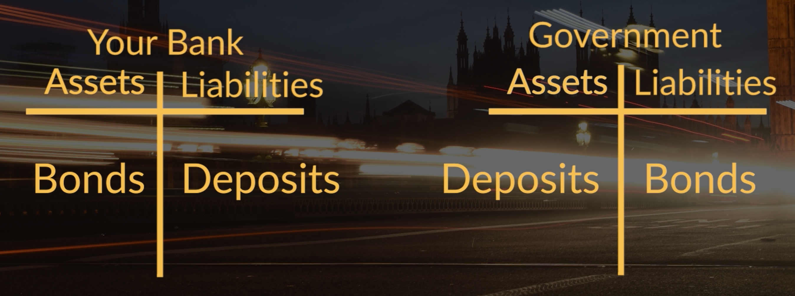

Following in the footsteps of [Zimbabwe](https://www.fin24.com/Economy/Africa/its-official-hyperinflation-has-returned-to-zimbabwe-20191012) and [Venezuela](https://www.forbes.com/sites/stevehanke/2019/11/13/venezuelas-hyperinflation-drags-on-for-a-near-record36-months/#69501f056b7b), the United Kingdom [announced](https://www.nasdaq.com/articles/bank-of-england-to-temporarily-finance-uk-government-spending-2020-04-09) it will turn to monetary finance for its Coronacrisis spending. So, what exactly is monetary finance? Why has the UK started using it? And will it lead to hyperinflation?

*If you prefer to consume this story in video format, check it out here:*

<iframe width="560" height="315" src="https://www.youtube.com/embed/daG2V9maY2k" frameborder="0" allow="accelerometer; autoplay; encrypted-media; gyroscope; picture-in-picture" allowfullscreen></iframe>

Before getting into the specifics, let’s start by discussing what monetary financing is. In short, it means that the central bank directly finances government spending by creating money.

To understand how this works it is easiest to use simple balance sheets.

Above you see two balance sheets. One for the central bank and one for the government. Both have assets, such as debts that are owed to them, and liabilities, for example debts that they owe other. In case of monetary financing, the government issues bonds as a liability and gets reserves as an asset while the central bank holds these bonds as an asset and issues reserves as a liability. As mentioned in my [previous blog](http://www.moneymacro.rocks/2020-04-06-monetary-policy-1/), it is important to note here that reserves are basically money that only banks use.

Reserves being bank money means that the government can easily use them to pay anyone who has a bank account. This works as follows. If the government pays you, as a contractor or government employee, your bank will accept these reserves as an asset and will issue some new deposits to you as a liability.

Now, how does this compare to how the government normally borrows money?

Usually, the government goes to the bond market where it issues bonds. Here, investors like private banks, will buy these bonds. Banks might even do so by issuing deposits which the public holds. In that case balance sheets look as follows.

Note that in both cases the total amount of deposits (or money) held by the public, is the same.

And, on a side note, yes private banks can indeed create money to buy government bonds. Check out my other [blog](http://www.moneymacro.rocks/2020-03-28-banks-make-money/) on that.

### Why has the UK started doing monetary finance?

Last week, the United Kingdom became the first government to start monetary financing itself in response to the Corona crisis. The main reason for this is that it is much quicker and more reliable than going to the bond markets. Two very important characteristics in a crisis like this, when the government needs to be able to spend quickly.

If the government issues bonds, it will need to issue these in the bond market and set an interest rate so all of them are bought by the public. However, this is not a given. So, if the government wants to raise funds quickly, it should set the interest somewhat too high. Otherwise, not all bonds will be sold and hence not all money that was needed will be collected.

This is different for Monetary Financing. Since the central bank is part of the government, the effective interest rate that the government pays is what the central bank pays private banks to hold these reserves. This is typically lower than what the government would otherwise pay. Also, with the central bank the government can be sure that all bonds will be purchased.

### Will monetary finance lead to hyperinflation?

This will not necessarily lead to hyperinflation. As you saw in the balance sheet example, the total quantity of money in the hands of the public will theoretically be the same. The amount of reserves and bonds in the financial system are different though.

Even before the Coronacrisis, there was already a trend to more reserves and less bonds in the financial system as the central bank was buying bonds with new reserves. This is known as quantitative easing, and a video on that will follow later.

### Why don't governments use monetary finance all the time?

Theoretically monetary financing is much more efficient than letting the government borrow via the bond market. So why not do it all the time? Well this brings us to the problem with monetary financing. And that is not about doing it per se but more about is about doing it too much.

The problem is that it is too easy. Hence, it might tempt governments to do this too much. So much so that excess money creation will increase demand for goods and services while supply cannot keep up. That is when price start to skyrocket. This is why hyperinflation happened in Zimbabwe and Venezuela.

However, the UK central bankers have told us that this is just a temporary measure and they hope that investors believe them.

But, do we believe them?
